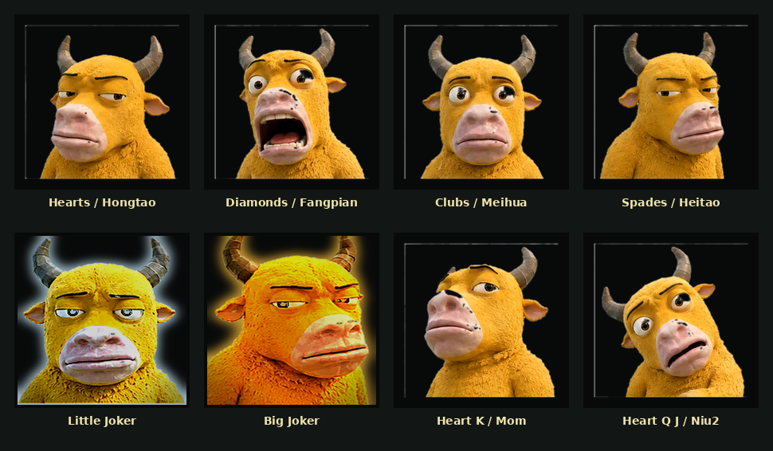
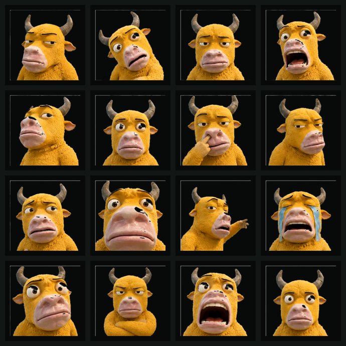

# Niulai Guandan

A four-player, two-team **Guandan** web game themed on the 2026 Chinese animated film *Niulai* (《牛来》). Create a room, share a 4-digit code, and start even if you are the only human — three robots fill empty seats.

This is a fan-made table. Card faces are retouched stills of the yellow calf from [niulai.co](https://niulai.co/), not generated lookalikes.



## 中文介绍

《牛来》主题的四人两队掼蛋网页桌：房间码开桌，人不够机器人补位，一个人也能先打起来。牌面是 [niulai.co](https://niulai.co/) 上的黄牛截图，裁过、去过底，不是 AI 生成的脸；大小王分别镀金和冷银，一眼能分开。进贡已经做了，没有抗贡。

- 建房、分享四位房间码，掉线回到原座
- 点开始即可，空位自动坐机器人
- 牌面、发牌轨迹、炸弹特效都按这桌的手感调过
- 界面可切 中 / 日 / EN

## 日本語

『牛来』モチーフの4人2チーム、カンダンのウェブ卓。部屋コードで開いて、人が足りなければロボットが座る。ひとりでもすぐ打てる。札の顔は [niulai.co](https://niulai.co/) の黄牛スチルを切り抜いて整えたもので、AIで作った顔ではない。大王は金、小王は冷たい銀。進貢あり、抗貢なし。

- 部屋をつくって4桁コードを渡す。切れても同じ席に戻れる
- 開始を押せば空席はロボット
- 配札の弧、爆弾演出、この卓用の手触り
- 表示は 中 / 日 / EN で切り替え

## Card faces

| Card | Face |
| --- | --- |
| Hearts | Deadpan calf (Niulai) |
| Diamonds | Open-mouth shock |
| Clubs | Vacant stare |
| Spades | Unimpressed side-eye |
| Little Joker | Half-lidded cold stare, silver rim |
| Big Joker | Side-eye, gold grade, gold rim |
| Heart K | Softer portrait (Mom) |
| Heart Q / J | Second calf (Niu2) |

The jokers are the same film stills, graded harder so they read as the two kings of the deck: gold and heavy for the Big Joker, cool silver for the Little Joker.

Source sheet (16 knocked-out stills):



## Features

- Room codes, reconnect to the same seat, instant auto-play on disconnect
- One-click start with three robots
- Portrait and landscape play; two-row hand in portrait
- Arced deal and play flights with gold motion trails
- Deal flies card backs first, then the whole hand flips
- Bombs, ranking banners, hints, 90s human-turn timeout then auto-play
- Tribute after a non-double-down game (no anti-tribute)
- Optional voice (WebRTC mesh). Refuse the mic and you can still play

## Rules (this table)

Two decks, 108 cards, 27 each. Level ranks run 2 through A. The heart of the current level is wild.

Legal shapes: single, pair, triple, triple+pair, straight, consecutive pairs, steel plate, airplane, 4–10 bombs, three-joker bomb, four-joker bomb.

First deal leads from the spade 3. Later deals lead from the previous winner. Scoring: double-down +3, 1st+3rd +2, 1st+4th +1. Climb to A, then win one more game to take the match.

## Run

```bash
npm install
npm start
```

Opens on `http://HOST:8787` (listens on `0.0.0.0:8787`). Copy the invite from the table HUD.

```bash
npm run check
```

runs a syntax check plus combo tests.

## Deploy

GitHub Pages will not work. This is a live Socket.IO table, not a static site. The table UI has a 中 / 日 / EN language switcher.

GitHub Actions runs Node 20 CI on push/PR, then a Node deploy job can curl a Render deploy hook (`RENDER_DEPLOY_HOOK` repo secret). Until that secret is set, the deploy job skips and stays green.

One-click Render from this repo:

[](https://render.com/deploy?repo=https://github.com/ChenYCL/niulai-guandan)

After deploy, open the Render URL, create a room, tap start (robots fill). Share the room code.

Render free instances sleep when idle; first open may take ~30s.

## Stack

Node, Express, Socket.IO, vanilla front-end. No build step. Theme art lives in `public/art/`; mapping is in `public/theme.js`.

## Credit

*Niulai* (《牛来》) character designs belong to their rights holders. Faces were taken from public meme stills on [niulai.co](https://niulai.co/) and cropped / background-removed for card use. Style notes also draw on [GoodTimeGGB/niulai-style](https://github.com/GoodTimeGGB/niulai-style).
